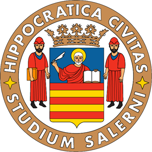

- Linkedin account 

### Hi there 👋

<!--
**liatrapanese/liatrapanese** is a ✨ _special_ ✨ repository because its `README.md` (this file) appears on your GitHub profile.

Here are some ideas to get you started:

-  I’m currently working on 
- 🌱 I’m currently learning ...
- 👯 I’m looking to collaborate on ...
- 🤔 I’m looking for help with ...
- 💬 Ask me about ...
- 📫 How to reach me: ...
- 😄 Pronouns: ...
- ⚡ Fun fact: ...
-->

### Studies 🎓:
 &nbsp;  &nbsp;  
* **Master's degree:** I am currently a MSc student in **Data Science and Business Informatics** @ University of _Pisa_
* **Bachelor's degree:** I graduated in **Computer Engineering**  @ University of Salerno 

           

